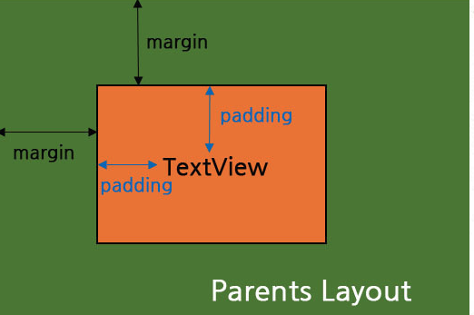

## Jetpack Compose UIに関して

# State → Compostion → Layout → Drawing →　UI 

> 루트 노드 
- 부모 노드가 없는 노드
- 트리의 최상위 노드 

> 리프 노드
- 자식 노드가없는 노드
- 트리의 가장 끝단에 위치 

```
@Composable
private fun Greeting(name: String) {
    Column( // 자식 요소들을 세로로 배치 
        modifier = Modifier
            .padding(24.dp)
            .fillMaxWidth() // 대신 Modifer은 가로로 꽉채울것
    ) {
        Text(text = "Hello,") // Text들을 세로로배치함
        Text(text = name)
    }
}
```
---

# 레이아웃(Layout)

> 흐름 레이아웃 
- FlowRow 

--- 

# Margin vs Padding 차이 

> margin 
- 부모 레이아웃의 테두리부터의 여백을 의미함

> padding
- 위젯 테두리로부터 위젯 안에의 내용 사이의 여백을 얘기함



