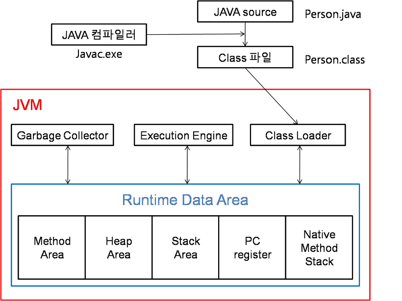
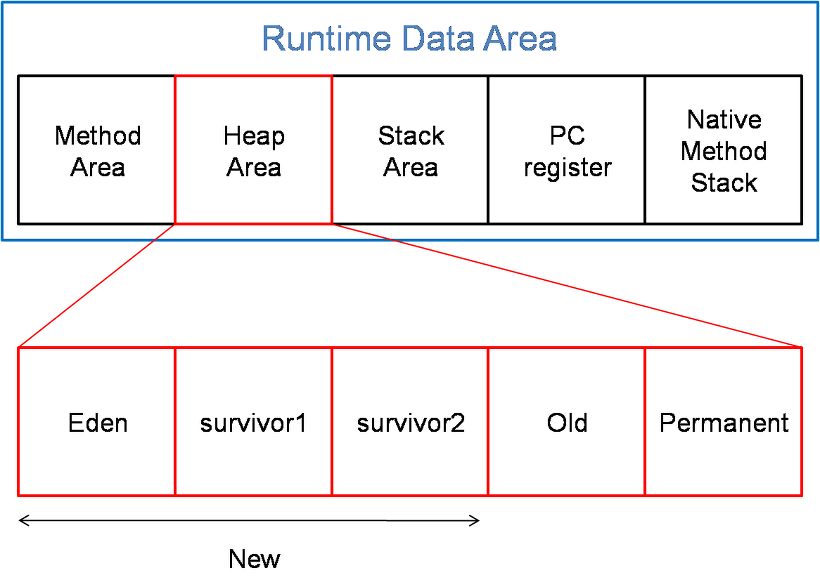

# 📘 Kotlin & Android 開発メモまとめ

---

## 🎨 themes.xml の構成理解

```xml
<style name="AppTheme" ...>   <!-- アプリ全体に適用されるスタイル -->
<style name="ActivityTheme" ...> <!-- 特定のアクティビティにのみ適用されるスタイル -->
```

✅ アプリ全体に適用：上側の `<style>`
✅ アクティビティ個別適用：下側の `<style>`
📌 ※TopBar がプレビューでは表示されたが、デバッグ実行時に表示されなかった問題は `AndroidManifest.xml` で解決済み

---

## 🏗️ <application> タグ vs <activity> タグ

```xml
<application>: アプリ全体の設定を定義
<activity>: 各画面（Activity）の設定を定義
```

---

## 🧩 Modifier とは？

> Composable に装飾や動作を追加するための "修飾子"

* UI を装飾するための Modifier
* 動作を追加するための Modifier（例: クリックなど）

---

## 🔄 StateFlow / Flow / LiveData

```kt
StateFlow:
- 観察可能な状態（value アクセス可）
- 状態ベース、初期値が必要
- UI が再描画される → 単発イベントには不向き

SharedFlow:
- 単発イベントの処理に適している
- UI の再描画は行わない
```

🧠 特定時点のデータ = `State`
📤 それを流す手段 = `StateFlow` / `SharedFlow`

---

## 🔽 DropDownItem の主なプロパティ

* `expanded`: ドロップダウンが展開されているかどうか
* `onDismissRequest`: 閉じる際に呼ばれるコールバック

---

## 🛠️ Kotlin のスコープ関数

`let`, `with`, `run`, `apply`, `also` → 可読性向上のために使用

---

## 🧷 @Binds と @Provides の違い

| 項目          | 説明                     |
| ----------- | ---------------------- |
| `@Binds`    | 実装クラスとインターフェースを結びつけるだけ |
| `@Provides` | 複雑なロジックを含む提供処理も可能      |

---

## 🧩 Entity vs Model

| 用途     | 層     | 説明                      |
| ------ | ----- | ----------------------- |
| Entity | データ層  | DB テーブルに対応するクラス         |
| Model  | ドメイン層 | ビジネスロジックや UI 状態を表現するクラス |

---

## ⚙️ AGP（Android Gradle Plugin）

* ビルド、テスト、配布プロセスを自動化するための Gradle プラグイン

---

## 🧱 App Build の流れ

```txt
.kt / .java / .xml → Gradle → DEX → AAB / APK
外部ライブラリ（.JAR / .AAR） → DEX に変換
```

| フォーマット | 説明                                      |
| ------ | --------------------------------------- |
| `.JAR` | 純粋な Java クラスファイル                        |
| `.AAR` | AndroidManifest.xml を含む Android 専用パッケージ |

---

## 🔧 kapt / ksp の違い

| ツール    | 説明                          |
| ------ | --------------------------- |
| `kapt` | Kotlin → Java → アノテーション処理   |
| `ksp`  | Kotlin 向け軽量アノテーションプロセッサ（高速） |

---

## 🧰 ビルド設定構成

```gradle
defaultConfig:
- アプリの基本設定（例: minSdkVersion など）

isMinifyEnabled:
- コードの難読化 / 縮小設定
- アプリサイズを削減しセキュリティを向上
```

```txt
Minify: 不要な空白・コメントの削除
Shrink: 未使用のクラスやメソッドの削除
```

---

## 🌊 Flow の概念

* 生産者（Repo） → Flow にデータを送信
* 消費者（UI） → Flow からデータを収集

```kt
lifecycleScope.launch {
    flow.collect { ... }
}
```

✅ 構成変更に強く、バックグラウンドでもリソースの無駄がない

📅 2025/06/19 (木)

* SELECT → UI に自動反映
* DELETE / UPDATE → UI 変化なし
* `suspend` とは併用不可（Flow 自体が非同期）

---

## 🧠 Kotlin キーワード

```kt
out: ジェネリクスの共変性（出力専用）を表すキーワード
R: Android リソースアクセス用自動生成クラス
```

---

## ⏱️ LocalDateTime vs Instant

| 項目     | LocalDateTime  | Instant     |
| ------ | -------------- | ----------- |
| タイムゾーン | ❌ なし（ローカル時間基準） | ✅ UTC 基準    |
| 用途     | 国内 / 地域向けサービス  | グローバルサービス向け |

---

## 🔗 onDelete オプション

1. `CASCADE` : 親が削除されると子も自動削除
2. `RESTRICT` : 子が存在する場合、親の削除を拒否
3. `SET NULL` : 親削除時、子の外部キーを NULL に
4. `NO ACTION` : 何もしない

---

## Listに addする時 JavaとKotilnが違った　

| 項目     | List  | 
| ------ | -------------- |
| Java |  | 
| Kotiln | 国内 / 地域向けサービス  | 

---

## viewModel() vs hiltViewModel何が違う？
まずは、hiltViewModel()から
```
@Composable
inline fun <reified VM : ViewModel> hiltViewModel(
    viewModelStoreOwner: ViewModelStoreOwner = checkNotNull(LocalViewModelStoreOwner.current) {
        "No ViewModelStoreOwner was provided via LocalViewModelStoreOwner"
    },
    key: String? = null
): VM {
    val factory = createHiltViewModelFactory(viewModelStoreOwner)
    return viewModel(viewModelStoreOwner, key, factory = factory)
}

@Composable
inline fun <reified VM : ViewModel, reified VMF> hiltViewModel(
    viewModelStoreOwner: ViewModelStoreOwner = checkNotNull(LocalViewModelStoreOwner.current) {
        "No ViewModelStoreOwner was provided via LocalViewModelStoreOwner"
    },
    key: String? = null,
    noinline creationCallback: (VMF) -> VM
): VM {
    val factory = createHiltViewModelFactory(viewModelStoreOwner)
    return viewModel(
        viewModelStoreOwner = viewModelStoreOwner,
        key = key,
        factory = factory,
        extras = viewModelStoreOwner.run {
            if (this is HasDefaultViewModelProviderFactory) {
                this.defaultViewModelCreationExtras.withCreationCallback(creationCallback)
            } else {
                CreationExtras.Empty.withCreationCallback(creationCallback)
            }
        }
    )
}
```

次は viewModel()で　
```
public inline fun <reified VM : ViewModel> viewModel(
    viewModelStoreOwner: ViewModelStoreOwner = checkNotNull(LocalViewModelStoreOwner.current) {
        "No ViewModelStoreOwner was provided via LocalViewModelStoreOwner"
    },
    key: String? = null,
    factory: ViewModelProvider.Factory? = null,
    extras: CreationExtras = if (viewModelStoreOwner is HasDefaultViewModelProviderFactory) {
        viewModelStoreOwner.defaultViewModelCreationExtras
    } else {
        CreationExtras.Empty
    }
): VM = viewModel(VM::class.java, viewModelStoreOwner, key, factory, extras)
```

違いは
- "factory"を viewModelStoreOwnerから生成するか　(hiltViewModel)
- 直接渡すか（viewModel）

また
- "extras"を ViewModelFactory → ViewModel関数から生成するか(hiltViewModel)
- 直接渡すか(viewModel)

---

## factoryは何？

- Kotilnにおけるインスタンス生成方法の一つ
- インスタンスの生成で、singleまたはfactoryを使う　
--- 

# singleと factoryの使いわけ
- 例としては Repositoryクラスのように決まった対象のDBアクセスする必要があり、かつ、アクセスする際に、一貫性を保つ必要があるケース
> single (Singleton)

- HttpClientクラスのような決まった設定値を全てのアプリで使い回すケース　
> single (Singleton)

- UseCaseのような画面(ViewModel)で必要になる度に生成された方がメモリのコストなどでメリットになるケース
> factory 

---

## factoryとは？
```
class User(val name : String) {
    companion object {
        fun from(name : String) : User {
            return User(name)
        }
    }
}
```

- companion objectが代表的
---
## inline

- 무의미한 객체 생성을 방지해줌 
- 정확한 사전의미는, 고차 함수를 쓰면 성능 오버헤드가 생기는데 그 오버헤드를 줄이기위해 사용
- 즉,쉽게얘기해서 함수 본문을 복사해서 호출위치에 붙여넣기함
- 런타임 성능 향상이 이루어짐 

## noinline


## crossinline

---

## HOF(Higher-Order Function)

- 함수의 인자로 다른 함수를 받거나 또는 함수 자체를 반환하는 함수 
```
fun calculate(x: Int,y: Int, operation: (Int,Int) -> Int) : Int {
    return operation(x,y)
}

fun sum(x: Int,y: Int) = x + y

fun main() {
    val sumResult = calculate(4,5, ::sum)
    val mulResult = calculate(4,5) {
        a,b -> a * b
    }
    println("sum Result $sumResult, And mul Result $mulResult")
}
```

- 함수를 반환하는 고차함수
```
fun operation(): (Int) -> Int {
    return ::square
}

fun square(x: Int) = x * x

fun main() {
    val func = operation()
    println(func(2))
}
```
---
## Android Network 


---
## Dispatcher 

> 스레드(Thread)에 코루틴(Coroutine)을 보낸다라는 의미 

Dispatchers.Default
- CPU를 많이 사용하는 작업을 Main Thread가 아닌 다른 Thread에서 CPU작업을함 
- CPU core 개수만큼 동시에 돌릴수있음 "최소2개가 돌림"
- 리스트 정렬,JSON Parsing 작업에 최적화

Dispatchers.Main 
- UI 작업을 위한 Main Thread로 이동시키는 코루틴 디스패치
- UI와 상호작용하는 작업을 실행하기 위해서만 사용 

Dispatchers.IO
- 디스크 또는 네트워크 작업 즉, 스레드를 오랫동안 블락킹하는 I/O 작업을 실행하기 위한 디스패치
- Dispatchers.Default와 쓰레드를 공유하고있음

Dispatchers.Unconfined
- 호출한 context를 기본으로 사용하는데 중단 후 다시 사용될때 context가 바뀌면 
바뀐 context를 따라감 

---

## Async 
코틀린에서는 2종류의 Thread가 존재 

- Thread
1. 하나의 프로세스 내에서 독립적으로 실행하는 단위 
2. 운영체재 수준에서 관리
3. 생성 및 관리에 오버헤드 발생가능성 O 
4. 동시성 처리에 유용, 스레드 수가 많아지면 성능 저하 
5. UI 스레드,Background 스레드

- Coroutine 
1. 코틀린에서 제공하는 경량 스레드
2. 스레드보다 가볍고 효율적인 동시성 프로그래밍 가능하게함 
3. 하나의 스레드에서 여러개의 코루틴 실행가능 
4. JVM 수준에서 관리
5. 적은 메모리,CPU 자원 사용
6. launch,async 등 코루틴 빌더를 사용하여 시작

---

## takeIf 

> true or null 을 반환함 

```
val animal = "Animal" 

val result = animal.takeIf { it.length >= 5 }

println(result)
```
---
## 엘비스 연산자(?:) 

> 왼쪽이 null이면 오른쪽 값을 써라 

```
data class Being(
    val name: String,
    val type: String
)

fun main() {
    val input = Being(
        name = "뽀삐",
        type = "animal"
    )

    val result = input
        .takeIf { it.name == "뽀삐" }?.type?: "얘는 뽀삐가 아닌데요"

    println(result)
}
```
---
# 안전 호출 연산자(?.) 

> null값일지도 모르는곳에 안전하게 접근


---

# SharedPreferences

- 간단한 데이터를 저장하고 불러올수있다 
- 어플을 꺼도 데이터가 유지된다라는점 (DB?)
- SharedPreferences는 앱에서 파일 형태로 데이터를 저장
- 데이터는 (key,value) 형태로 shread_prefs 폴더 안에 .xml파일로 저장 


---

# JVM (Java Virtual Machine)



1. Class Loader 
2. Execution Engine 
3. Garbage Collector
4. Runtime Data Area　

- 자바 소스 파일은 자바 컴파일러에 의해서 바이트코드인 형태인 클래스파일이되고<br>
클래스 파일은 클래스 로더가 읽어들이면서 JVM이 수행함 

1. Class Loader 
- JVM 내로 클래스파일을 로드하고,링크를 통해 배치하는 작업을 수행하는 모듈
- 런타임 시 동적으로 클래스를 로드 
<br>

2. Execution Engine 
- Class Loader에 의해 메모리에 적재된(바이트 코드)들을 기계어로 변경해 명령어 단위로 실행 
- Interpreter방식,JIT 컴파일러를 이용하는 방식
- Interpreter방식을 사용하다가 기준이 넘어가면 JIT 컴파일러 방식으로 실행 

3. Garbage Collector (GC)
- Heap 메모리 영역에 생성된 객체들 중 참조되지않는 객체들을 탐색 후 제거하는 역할
- GC가 역할을 하는 시간은 정확히 모름,

4. Runtime Data Area 
- JVM의 메모리 영역으로 자바 앱을 실행할때마다 사용되는 데이터들을 적재하는 영역
- Method Area,Heap Area,Stack Area,PC Register, Natvie Method Stack으로 나눔 



1. Method Area(메소드 영역)
- 모든 쓰레드가 공유하는 메모리 영역
- 클래스,인터페이스,메소드,필드,static 변수 등의 바이트 코드들을 보관 

2. Heap Area(힙 영역)
- 모든 스레드가 공유하며, new 키워드로 생성된 객체와 배열이 생성되는 영역
- Method Area에 로드된 클래스만 생성가능, GC가 참조되지않는 메모리를 확인하고 제거하는 영역

3. Stack Area(스택 영역)
- 메서드 호출 시마다 각각의 스택 프레임을 생성
- 메서드 안에서 사용되는 값들을 저장하고,호출된 메서드의 매개변수,지역변수,리턴 값 및 연산의 값 저장
- 메서드 수행이 끝나면 프레임별로 삭제함

4. PC Register(PC 레지스터)
- 쓰레드가 시작될떄 생성되며, 생성될때마다 생성되는공간,쓰레드마다 하나씩 존재 
- 현재 쓰레드가 실행되는 부분의 주소와 명령을 저장하고있음

5. Native Method Stack 
- 자바 외 언어로 작성된 네이티브 코드를 위한 메모리영역 

---

# @SuppressLint("")

> Compose 컴포저블 함수안에서 CoroutineScope.launch{}를 직접호출했을떄 생기는 Lint경고를 무시 

---

# @OptIn(ExperimentalMaterial3Api::class)

> ExperimentalMaterial3Api로 마킹된 Jetpack Compose Material3라이브러리의 실험적인 API사용 선언 

```
            CoroutineScope(Dispatchers.Main).launch {
                val userDao = LocalDatabase.getDatabase(applicationContext).userDao()
                val users = userDao.loadAllUser().first()
                Log.d("CheckUsers", "유저 수: ${users.size}")
            }
```

# BuildConfigField 

- Android 프로젝트에서 Gradle 빌드 설정을 통해 BuildConfig 클래스에 사용자 정의필드 추가 
- 

📦 本ドキュメントは Kotlin & Android 開発者向けメモまとめ `.md` フォーマットです。
✍️ 作成者: IM
